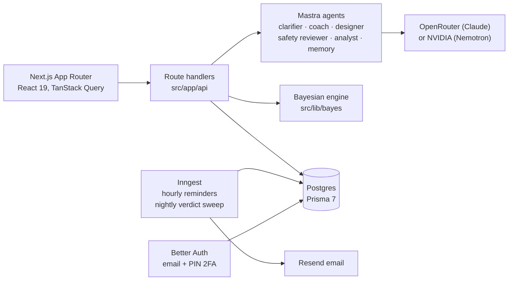

# Hunch

**Got a hunch about yourself? Prove it.**

Hunch turns a gut feeling ("coffee after lunch wrecks my sleep") into a small, fair experiment on yourself, and then answers it from your own data. AI does the talking; the math does the judging.

**Live:** [hunch-by-gav.vercel.app](https://hunch-by-gav.vercel.app)

## How it works

1. **Drop a hunch.** Say it in plain words. A coach asks a couple of quick questions, then sharpens it into one testable claim with a measure you can log daily and the things worth tracking alongside it.
2. **Run the plan.** Hunch designs an A → B → A trial (usual routine, the change, back to usual) sized for the effect you expect, and a safety review checks it first. You log once a day; reminders arrive in your local evening.
3. **Get a verdict.** A Bayesian engine compares the phases and reports which way the measure moved and how likely the change is real. An AI analyst then explains that number in plain words; it never computes or changes it.

## Design decisions

| Decision | Why |
| --- | --- |
| **The model never decides the verdict.** Beta-binomial (yes/no) and normal-normal (numeric) conjugate models compute the posterior in plain TypeScript (`src/lib/bayes`). | An answer people act on has to be reproducible and auditable, not a model's opinion. |
| **Two safety layers, no user override.** A deterministic medication check runs before any model call; an AI safety reviewer then checks every plan. A refused plan can only be kept as a log that changes nothing. | Health-adjacent advice fails closed. The cheap check costs no tokens and can't be talked out of its answer. |
| **Observational mode.** When a change can't be applied on a schedule ("play basketball"), Hunch logs it daily and reports a correlation, clearly labelled as one. | Some honest questions can't be randomised; the app says what it can and can't conclude. |
| **Days are the user's days.** Phases, check-ins and reminders follow the user's own timezone. | "Today" at 11pm in Los Angeles is already tomorrow in UTC, and off-by-one days corrupt a trial. |
| **Latency measured, then designed for.** The plan is drafted in the background while the user reads the confirm screen; verdicts are computed overnight; the coach's answer streams as it's written. | The confirm step fell from 13.5s to 47ms. |
| **Memory across experiments.** Concluded verdicts become edges in a small causal graph that shapes the next hunch's questions, and tested findings are kept apart from things only seen together. | A user shouldn't be re-asked what they already proved. |

## Architecture



**Stack:** Next.js 16, React 19, TypeScript, Tailwind 4 + shadcn/ui, Prisma 7 on Postgres (Neon in production), Better Auth, Mastra + AI SDK, Inngest, Zod 4, Vitest. Deployed on Vercel.

## How it was built

- **Spec first.** Each feature started as a written design with goals, rejected alternatives and acceptance criteria, then a task-by-task plan. There are 14 specs and 18 plans in [`docs/superpowers`](docs/superpowers), plus the original [`PLAN.md`](PLAN.md), [`RESEARCH.md`](RESEARCH.md) and [`RULES.md`](RULES.md).
- **Small, phased PRs.** More than 40 merged PRs, with a conventional-commit history that explains the why.
- **AI-assisted, human-directed.** Implementation was done with AI coding agents working from those specs; scoping, design decisions, review and merges are the owner's.
- **Tested.** About 700 unit and route tests, plus separate eval suites that run the real agents against fixed cases (`npm run test:eval`). CI runs typecheck, lint and tests on every PR, and `main` only accepts green PRs.

## Run it locally

Needs Node 22+ and Docker.

```bash
cp .env.example .env          # then set BETTER_AUTH_SECRET and OPENROUTER_API_KEY
npm ci
npm run db:up                 # Postgres in Docker
npx prisma migrate deploy     # creates the schema
npm run dev                   # the app on :3000
```

Optional: run `npx inngest-cli@latest dev -u http://localhost:3000/api/inngest` for reminders and the verdict sweep. Without `RESEND_API_KEY`, emails are printed to the console.

| Command | What it does |
| --- | --- |
| `npm test` | Unit and route tests |
| `npm run test:eval` | Agent evals against the real model (needs a key) |
| `npm run typecheck` / `npm run lint` | Types and lint |

## Project layout

```
src/
  app/            pages and API routes (auth, home, hunch flow)
  mastra/         agents, workflows, model provider
  lib/bayes/      the verdict math
  lib/safety/     medication check and diary fallback
  lib/memory/     causal graph and recall of past findings
  inngest/        reminders and the overnight verdict sweep
  components/     UI (landing, app, hunch flow)
prisma/           schema and migrations
docs/superpowers/ design specs and implementation plans
```

## Status

A personal project, live and in active development. Hunch is not medical advice, and it won't design experiments that change prescribed medication.
